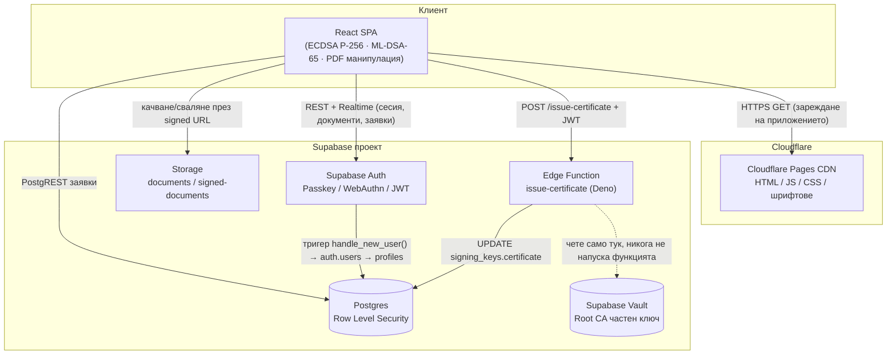
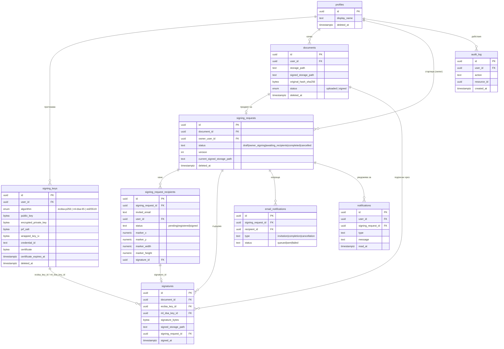
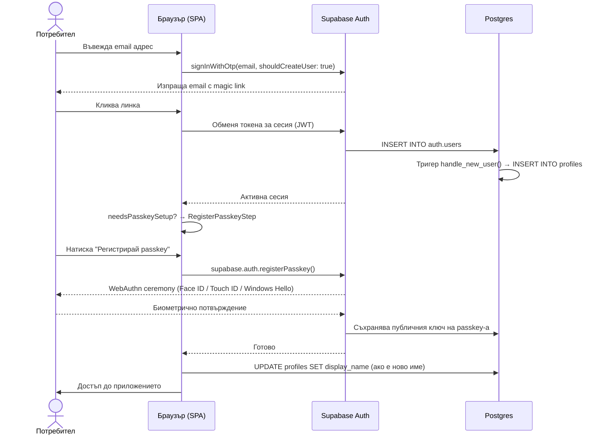
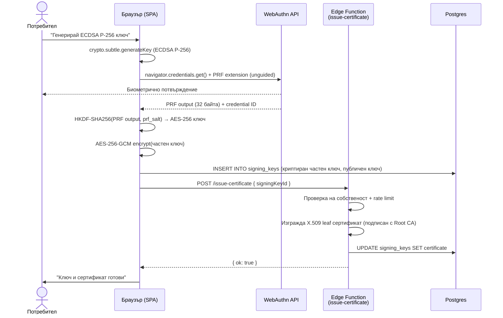
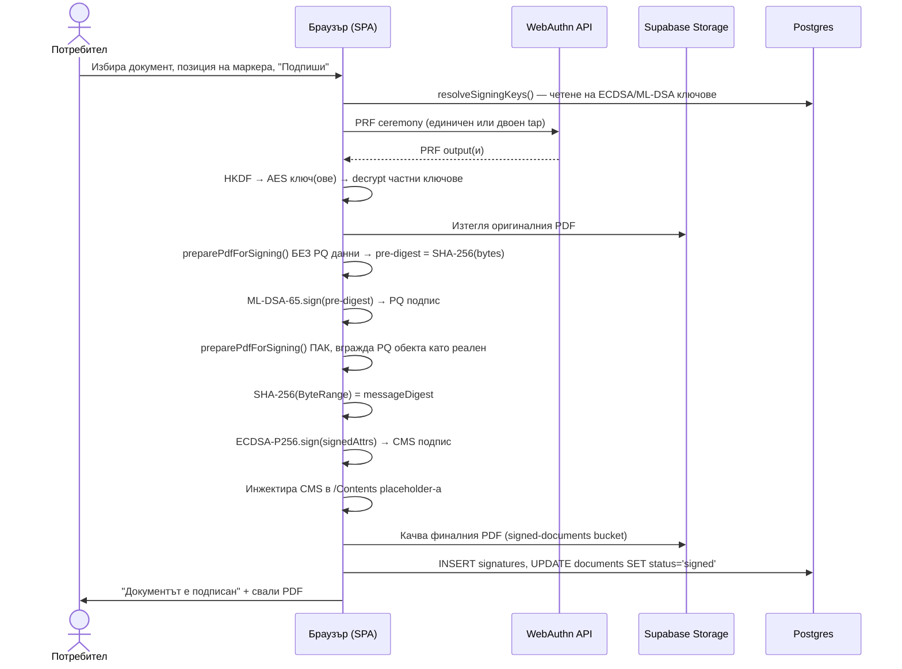
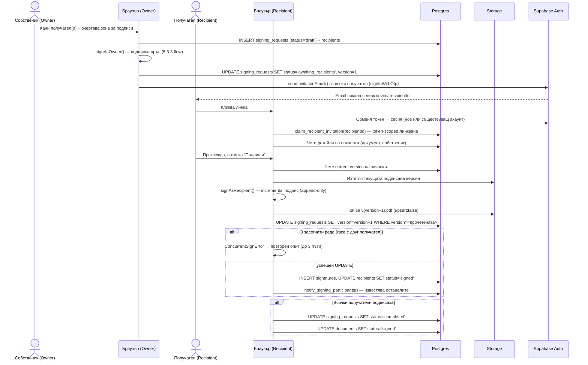
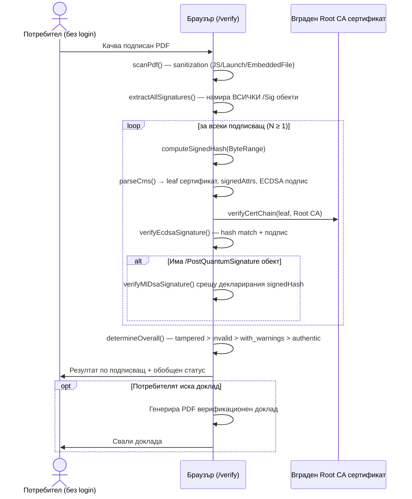

# Раздел 5. Архитектура

## 5.1 Обща архитектура

SignShield е реализиран изцяло като клиент-сървър приложение (client-server model), при което **клиентът извършва цялата криптографска работа**, а сървърната инфраструктура се грижи единствено за съхранение на данни, автентикация и една-единствена чувствителна операция — издаването на сертификати. Това разпределение на отговорностите не е случайно техническо решение, а пряко следствие от изискването частните ключове никога да не напускат устройството на потребителя в незашифрован вид (виж Раздел 4.3): щом ключовете живеят само в паметта на браузъра, логично е и операциите, които ги ползват — генериране, декриптиране, подписване — да се изпълняват там.

Приложението е изградено от шест основни компонента:

- **Browser (React SPA)** — цялата бизнес логика и криптография: WebAuthn ceremonies, HKDF деривация на ключове, ECDSA P-256 и ML-DSA-65 подписване, манипулация на PDF байтове, верификация на подписи. Нищо от изброеното не изисква сървър — верификацията например работи офлайн, дори без интернет връзка, след първоначалното зареждане на страницата.
- **Cloudflare Pages** [9] — статичен хостинг за компилирания SPA bundle (HTML, JavaScript, CSS, шрифтове, PDF.js worker). Автоматичен deploy при всеки push към `main` клона на GitHub хранилището; глобален CDN осигурява ниска латентност при зареждане навсякъде по света.
- **Supabase** [8] **Postgres** — релационна база данни за всички метаданни на приложението: потребителски профили, сертификатни ключове (в криптиран вид), документи, подписи, многоучастникови заявки. Защитена изцяло чрез Row Level Security (RLS) политики — виж 5.4.
- **Supabase Storage** — частни S3-съвместими bucket-и (`documents`, `signed-documents`) за самите PDF файлове. Достъпът е чрез временни signed URL адреси, не чрез директни пътища.
- **Supabase Auth** — управлява passkey (WebAuthn/FIDO2) идентичностите и издава JWT сесийни токени. Единственият механизъм за вход в приложението — няма парола никъде в системата.
- **Supabase Edge Functions (Deno runtime** [10]**)** — единствената сървърна операция с достъп до чувствителна тайна: издаването на X.509 сертификати от частния ключ на вътрешния Root CA (mini-CA, виж 5.4). Всичко останало в приложението работи без сървърна логика.

Диаграмата по-долу показва как шестте компонента комуникират помежду си при типична сесия на потребителя.

*[FIG 1: Deployment диаграма — компоненти на SignShield и посоките на комуникация]*

Важна архитектурна особеност е, че браузърът комуникира директно с Postgres чрез PostgREST (вградения REST слой на Supabase) — без посредничещ Node.js или друг custom бекенд. Това е възможно, защото цялата авторизационна логика е преместена в базата данни чрез RLS политики (5.4), а не в приложен слой. Единственото изключение е Edge Function-ът за сертификати, който съществува именно защото частния ключ на Root CA не може да бъде изложен на клиента — той трябва да остане в среда, недостъпна за браузъра.

## 5.2 Модел на данните

Схемата на базата данни е израснала органично през осем фази на разработка — от единичен потребител с един подпис (Фаза 0–4) до пълноценен workflow за подписване от няколко страни (Фаза 8, "Multi-signer"). Крайният резултат се състои от девет таблици в `public` схемата на Postgres, всички защитени с Row Level Security.

*[FIG 2: ER диаграма — база данни на SignShield]*

**`profiles`** съхранява показваното име на потребителя. Редът се създава автоматично чрез Postgres тригер при регистрация (`handle_new_user()`), а не от клиентски код — гарантира, че всеки автентикиран потребител винаги има точно един профилен запис.

**`signing_keys`** е най-чувствителната таблица в схемата. Всеки ред представлява един подписващ ключ (ECDSA P-256 или ML-DSA-65) и съдържа частния ключ **само** в AES-256-GCM криптиран вид (`encrypted_private_key`), заедно с материалите, нужни за декриптирането му — `prf_salt` (уникална сол за WebAuthn PRF ceremony-то), `wrapped_key_iv` (инициализационен вектор за AES-GCM) и `credential_id` (кой passkey е ползван). Полето `certificate` пази X.509 сертификата (за ECDSA) или JSON attestation (за ML-DSA-65), издаден от вътрешния Root CA. Backend-ът никога не вижда декриптирания частен ключ — той съществува единствено временно, в паметта на браузъра, по време на самата операция по подписване.

**`documents`** пази метаданните на качения PDF — оригиналния път в storage, хеша при качване и, след подписване, пътя на подписаната версия. Статусът е умишлено опростен до `uploaded`/`signed` — целият по-сложен многоучастников progress живее в `signing_requests`, за да не се налага миграция на съществуващата логика, която чете `documents.status`.

**`signatures`** е одиторски запис за всеки индивидуален подпис — коя двойка ключове е ползвана (`ecdsa_key_id`, задължителен; `ml_dsa_key_id`, nullable — ML-DSA-65 е препоръчителен, не задължителен), суровите байтове на CMS структурата и точния storage път на файла, който този подпис е произвел. Таблицата поддържа само `SELECT` и `INSERT` на ниво RLS политика — умишлено няма `UPDATE`/`DELETE`, защото подписът е доказателство, че документът е бил подписан в конкретен момент; позволяването на промяна би обезсмислило одиторската му функция.

**`signing_requests`** и **`signing_request_recipients`** реализират многоучастниковия workflow (Фаза 8, разгледан подробно в 5.3.4 и 5.5). Заявката пази текущата версия на файла (`current_signed_storage_path`) и брояч `version`, ползван за optimistic concurrency control при паралелно подписване от няколко получателя. Всеки получател е отделен ред с позиция на визуалния маркер и статус на процеса (`pending` → `registered` → `signed`).

**`email_notifications`** проследява доставката на покани по email (Резенд-подобен delivery tracking), а **`notifications`** захранва вътрешно-приложен нотификационен център — когато един участник подпише, останалите виждат съобщение в интерфейса, без да чакат email.

**`audit_log`** е единствената съзнателно **immutable** таблица в схемата — няма поле `deleted_at`, а RLS политиките разрешават само `SELECT` и `INSERT`. Всяко чувствително действие (вход, генериране на ключ, подписване, издаване на сертификат) оставя необратим запис.

Останалите пет таблици следват принципа на **soft deletion**, установен в Раздел 4.3: вместо `DELETE`, изтриването е `UPDATE ... SET deleted_at = NOW()`, а всички `SELECT`/`UPDATE` RLS политики филтрират допълнително по `deleted_at IS NULL`. Мотивацията е правна и практическа едновременно — вече издаден подпис трябва да остане проверим завинаги, дори ако потребителят по-късно изтрие акаунта или ключа си (публичният ключ вече е вграден трайно в самия PDF файл, независимо от състоянието на базата данни).

## 5.3 Основни потоци

Този раздел проследява петте най-съществени потока на изпълнение в приложението — от регистрация до верификация — представени като диаграми на последователността (sequence diagrams).

### 5.3.1 Signup + Passkey регистрация

*[FIG 3: Sequence diagram — регистрация и passkey ceremony]*

Регистрацията умишлено избягва отделен "sign up" екран с потребителско име и парола. Вместо това се ползва механизмът `signInWithOtp` на Supabase Auth с флаг `shouldCreateUser: true` — идентичен път обслужва едновременно нова регистрация, обикновен вход и (в Фаза 8) приемане на покана за подписване от друг потребител, което значително опростява кодовата база. Едва след потвърждение на email адреса потребителят преминава през истинската WebAuthn ceremony, при която устройството генерира нова асиметрична двойка ключове (публичният се регистрира при Supabase Auth) и биометрията никога не напуска устройството.

### 5.3.2 Генериране на подписни ключове

*[FIG 4: Sequence diagram — генериране на подписващ ключ и издаване на сертификат]*

Генерирането на ключ и деривацията на неговия защитен обвиващ ключ (wrapping key) са две отделни криптографски операции, свързани чрез PRF extension-а на WebAuthn. Собственият подписващ ключ (ECDSA P-256 или ML-DSA-65) се генерира изцяло в браузъра чрез Web Crypto API, съответно чрез `@noble/post-quantum`. Той никога не е предназначен да бъде видим — веднага след генериране бива обвит с AES-256-GCM ключ, изведен от WebAuthn PRF output-а чрез HKDF-SHA256. Резултатът е верига на доверието, в която самата биометрия на потребителя е крайният защитен елемент: без физическо докосване на устройството не съществува начин AES ключът да бъде възстановен.

Издаването на сертификат е единствената стъпка от целия жизнен цикъл на ключа, изискваща сървърна намеса — Edge Function-ът приема публичния ключ (никога частния), проверява собствеността чрез JWT, и изгражда leaf X.509 сертификат, подписан с частния ключ на вътрешния Root CA (детайли в 5.4).

### 5.3.3 Подписване (single-signer)

*[FIG 5: Sequence diagram — единичен (single-signer) поток на подписване]*

Технически най-нетривиалната част от този поток е **редът**, в който се изчисляват двата подписа. ECDSA P-256 подписът се вгражда в `/Contents` под формата на CMS (Cryptographic Message Syntax) [7] структура — стандартният контейнер, който Adobe Acrobat разпознава. И ECDSA, и ML-DSA-65 подписват дайджест на документа, но всеки алгоритъм подписва различен дайджест поради архитектурно ограничение: PDF стандартът изисква стойността в `/ByteRange` да изключва **точно** байтовете на `/Contents` placeholder-а, нищо повече — Adobe Acrobat отхвърля подпис, при който изключеният диапазон е по-широк ("SigDict /Contents illegal data"). Ако ML-DSA-65 подписът трябваше да живее в същия изключен диапазон като ECDSA (за да остане "защитен" от манипулация), диапазонът би станал по-широк от `/Contents` и Adobe валидацията би се провалила.

Решението е двустъпков процес: документът се подготвя веднъж **без** ML-DSA данни, за да се получи "pre-digest" — SHA-256 хеш на документа във вида, в който ще изглежда точно преди `/Sig` обекта да съществува. ML-DSA-65 подписва този pre-digest. След това документът се подготвя **отново**, този път вграждайки готовия ML-DSA подпис като напълно реален обект (не placeholder), позициониран **преди** `/Sig` обекта в същата ревизия на файла. Едва тогава се изчислява финалният `/ByteRange` — тесен, обхващащ само `/Contents` — и ECDSA P-256 подписва точно него. Резултатът е транзитивна защита: тъй като целият ML-DSA-65 обект вече седи вътре в диапазона, защитен от ECDSA хеша, всяка манипулация на постквантовия подпис би скъсала ECDSA верификацията — ML-DSA-65 не се нуждае от собствен независим механизъм за детекция на промяна.

### 5.3.4 Multi-signer workflow

*[FIG 6: Sequence diagram — многоучастников (multi-signer) поток на подписване]*

За разлика от единичното подписване, тук всеки получател подписва **инкрементално** върху последната налична версия на файла (append-only PDF update, виж 5.5) — а не документът се пресъздава от нулата. Тъй като получателите могат да отворят поканата по всяко време и потенциално да подпишат почти едновременно, потокът включва механизъм за optimistic concurrency control (детайли в 5.5), реализиран чрез условен `UPDATE ... WHERE version = <прочетена стойност>`.

### 5.3.5 Верификация

*[FIG 7: Sequence diagram — верификация на подписан документ]*

Верификацията е публична страница, достъпна без login, и работи изцяло офлайн — файлът никога не напуска браузъра, а единствената външна зависимост е сертификатът на Root CA, вграден статично в JavaScript bundle-а при компилация. Модулът поддържа произволен брой подписващи (N ≥ 1) в един и същ документ, тъй като multi-signer файловете съдържат по един `/Sig` обект на всеки участник — единичното подписване е частен случай (N = 1) на същия код път, без специална обработка.

## 5.4 Модел на сигурността

Сигурността на SignShield е изградена на няколко независими защитни слоя, всеки от които покрива различна заплаха. Целта е компрометирането на един слой да не води автоматично до компрометиране на цялата система.

**Транспорт.** Цялата комуникация минава през HTTPS — гарантирано автоматично от Cloudflare Pages (статичния фронтенд) и от Supabase (API, storage, Edge Functions). Няма endpoint в системата, достъпен по обикновен HTTP.

**Автентикация.** Единственият механизъм за вход е passkey (WebAuthn/FIDO2) [2] — няма парола никъде в системата, следователно няма и класически атаки от типа credential stuffing, phishing на парола или брутфорс. Всяка сесия се представя чрез Supabase-издаден JWT токен.

**Контрол на достъпа (Row Level Security).** RLS [1] е **единственият** слой на изолация между потребителите в приложението — приложен на ниво база данни, а не в клиентски или сървърен код, който потенциално може да бъде заобиколен. Философията, следвана последователно във всички 18 миграции на схемата, е "always deny by default, explicit allow per user_id": PostgREST заявките, идващи директно от браузъра, се филтрират автоматично от Postgres според `auth.uid()` в текущата JWT сесия — дори при грешка в клиентския код, потребител физически не може да прочете чужд ред. Multi-signer таблиците (`signing_requests`, `signing_request_recipients`) добавят допълнителен слой сложност: собственикът на заявката вижда всичко, но всеки получател вижда единствено собствения си ред — email адресите на другите получатели никога не изтичат към чужд участник. За операции, които изискват "привилегия" извън обичайния row-ownership модел — например линкване на нов потребител към покана, която все още не му принадлежи, или запис на нотификация за друг потребител — схемата ползва `SECURITY DEFINER` функции (`claim_recipient_invitation`, `notify_signing_participants`) с точно ограничена, одитируема логика, вместо да отваря общ INSERT достъп.

**Данни в покой.** Частните подписващи ключове никога не се записват в четим вид никъде извън паметта на браузъра по време на активна операция. В базата данни те съществуват единствено като AES-256-GCM шифротекст. Ключът за това криптиране (wrapping key) не се съхранява никъде — той се извежда наново при всяка операция чрез HKDF-SHA256 [3] от WebAuthn PRF output-а, който самият изисква биометрично потвърждение на потребителя. С други думи, "паролата" за декриптиране на частния ключ буквално е отпечатъкът или лицето на потребителя, физически присъстващо на неговото устройство — тя никога не пътува по мрежата и сървърът никога не я вижда.

**Инфраструктура за сертификати (mini-CA).** Частният ключ на Root CA — коренът на доверие за цялата система — се съхранява единствено като Supabase Secret, достъпен само от изпълнителната среда на Edge Function-а `issue-certificate`; клиентският код никога няма достъп до него. Всеки издаден leaf сертификат [6] носи `basicConstraints CA:FALSE` и ограничен `keyUsage` (само `digitalSignature`) — дори при теоретична компрометация на конкретен потребителски ключ, той не може да бъде използван за издаване на нови сертификати от чуждо име. Edge Function-ът допълнително проверява собствеността на ключа спрямо JWT-то на заявителя и налага rate limit (максимум 10 издадени сертификата на потребител в минута), за да ограничи злоупотреба дори от автентикиран, но злонамерен клиент.

**Санитизация на входа.** Преди приемане, всеки качен PDF се сканира за вградени активни елементи — `/JavaScript`, `/Launch` действия, `/EmbeddedFile` обекти — и се отхвърля с ясно съобщение при откриване. Верификационният модул допълнително минава файла през същата проверка преди обработка, тъй като приема произволни, непотвърдени PDF файлове от анонимни потребители.

**Одит.** Всяко чувствително действие — вход, генериране на ключ, издаване на сертификат, подписване — оставя запис в неизменимата (immutable) таблица `audit_log`, филтруема само по собствения `user_id` на извършителя.

**Дългосрочна валидност (crypto-agility).** Хибридната схема осигурява защита срещу два различни хоризонта на заплахата едновременно: ECDSA P-256 гарантира съвместимост с настоящата PAdES/Adobe инфраструктура [5], докато ML-DSA-65 [4] пази валидността на документа дори ако класическата елиптична криптография бъде компрометирана от бъдещ квантов компютър. Известно ограничение (документирано и в Раздел 4.3): приложението не интегрира Time Stamp Authority, следователно подписите отговарят на профила PAdES-B-Basic, а не на по-строгия PAdES-B-T — добавянето на TSA е идентифицирано като приоритетна следваща стъпка за производствено внедряване.

## 5.5 Multi-signer архитектурни решения

Разширяването на приложението от единичен подписващ (Фаза 0–7) към workflow с няколко участника (Фаза 8) наложи няколко нетривиални архитектурни решения, всяко от които представлява компромис между простота на имплементацията и реалистично поведение на потребителите.

**Паралелно, не последователно подписване.** Ранен вариант на дизайна разглеждаше строго последователен (sequential) workflow — получател №2 не може да подпише преди получател №1. Реализираният модел позволява на всички поканени получатели да подписват в произволен ред, веднага след като собственикът е подписал пръв. Мотивацията е практическа: реалните документи с няколко страни (например договор между няколко физически лица) рядко имат естествена йерархия на подписване — налагането на изкуствен ред би затруднило потребителите без реална полза за сигурността.

**Optimistic concurrency вместо server-side заключване.** Тъй като получателите могат да подпишат по всяко време, независимо един от друг, съществува реален риск от състезателно условие (race condition), ако двама получатели се опитат да подпишат едновременно — всеки инкрементален подпис трябва да се приложи върху **последната** версия на файла, никога върху остаряла. Вместо песимистично заключване на ниво база данни (което би изисквало допълнителна инфраструктура и внимателно управление на locks/timeouts), системата ползва брояч `version` в `signing_requests`: всеки получател чете текущата версия преди да подпише, а финалният запис е условен `UPDATE ... WHERE version = <прочетената стойност>`. При race условие заявката засяга нула редове — клиентският код разпознава това и автоматично повтаря целия опит (до три пъти), включително нова WebAuthn ceremony, тъй като дайджестът на документа вече се е променил след успешния подпис на другия участник.

**Token-scoped линкване на получатели, не directly по email.** Поканите се идентифицират по уникален `recipient_id`, а не директно по email адрес на поканения. Линкването между покана и реален потребителски акаунт става само чрез изричен `claim_recipient_invitation()` извикване, изпълнено от логнатия потребител, който потвърждава собствения си email спрямо `invited_email` на конкретния ред. Алтернативата — автоматично линкване по съвпадение на email адрес при всяко зареждане — създава уязвимост тип enumeration attack: злонамерен потребител би могъл да провери дали даден email адрес е бил поканен за подписване на конкретен документ, без изобщо да има достъп до пощенската кутия. Token-scoped моделът елиминира тази възможност изцяло.

**Инкрементални PDF актуализации (append-only), не пресъздаване.** При всеки следващ подпис документът не се генерира наново от нулата — нов `/Sig` обект, заедно с необходимите auxiliary структури (redefined `/AcroForm`, `/Annots`), се добавя чрез append-only incremental update върху съществуващите байтове. Причината е двойна: първо, пресъздаването на файла би нарушило вече вградения подпис на предходния участник (байтовият диапазон, който той е подписал, трябва да остане непроменен завинаги); второ, incremental update е стандартният, PDF-спецификационно предвиден механизъм точно за тази ситуация — множество независими страни добавят подпис към един и същ документ във времето, без никоя от тях да презаписва работата на предходната.

**Конвенция за пътя на файловете в storage.** За разлика от единичното подписване, при което пътят следва потребителя (`<user_id>/<filename>`), многоучастниковите версии се пазят под `<signing_request_id>/v<version>.pdf` — папката представлява заявката, не конкретен потребител, тъй като файлът логически принадлежи на целия процес, не на един-единствен участник. Тази конвенция изисква собствени RLS политики върху `storage.objects`, различни от простото сравнение с `auth.uid()`, използвано другаде — достъпът се определя чрез проверка дали заявителят е собственик ИЛИ регистриран получател на съответната `signing_request_id`.

---

## Използвана литература (раздел 5)

[1] PostgreSQL Global Development Group. *Row Security Policies* (Политики за защита на редове). PostgreSQL 16 Documentation, Chapter 5.9. https://www.postgresql.org/docs/current/ddl-rowsecurity.html. 2024.

[2] World Wide Web Consortium. *Web Authentication: An API for accessing Public Key Credentials, Level 3* (Уеб автентикация: API за достъп до публични ключови идентификатори, ниво 3). https://www.w3.org/TR/webauthn-3/. 2023.

[3] Krawczyk, H., Eronen, P. *HMAC-based Extract-and-Expand Key Derivation Function (HKDF)* (HMAC-базирана функция за деривация на ключове). RFC 5869. https://datatracker.ietf.org/doc/html/rfc5869. Май 2010.

[4] National Institute of Standards and Technology. *Module-Lattice-Based Digital Signature Standard* (Стандарт за цифров подпис, базиран на модулни решетки). FIPS 204. https://csrc.nist.gov/pubs/fips/204/final. Август 2024.

[5] European Telecommunications Standards Institute. *PDF Advanced Electronic Signatures (PAdES). Part 1: Building blocks and PAdES baseline signatures* (Усъвършенствани електронни подписи за PDF. Част 1). ETSI EN 319 142-1. https://www.etsi.org/deliver/etsi_en/319100_319199/31914201/. 2016.

[6] Cooper, D., Santesson, S., Farrell, S., Boeyen, S., Housley, R., Polk, W. *Internet X.509 Public Key Infrastructure Certificate and Certificate Revocation List (CRL) Profile* (X.509 профил на сертификати и списъци за отмяна). RFC 5280. https://datatracker.ietf.org/doc/html/rfc5280. Май 2008.

[7] Housley, R. *Cryptographic Message Syntax (CMS)* (Криптографски синтаксис на съобщения). RFC 5652. https://datatracker.ietf.org/doc/html/rfc5652. Септември 2009.

[8] Supabase Inc. *Supabase — The Open Source Firebase Alternative* (Open-source алтернатива на Firebase). https://supabase.com. 2024.

[9] Cloudflare Inc. *Cloudflare Pages — Deploy web projects in record time* (Хостинг платформа за уеб проекти). https://pages.cloudflare.com. 2024.

[10] Deno Land Inc. *Deno — A modern runtime for JavaScript and TypeScript* (Съвременна среда за изпълнение на JavaScript и TypeScript). https://deno.com. 2024.
